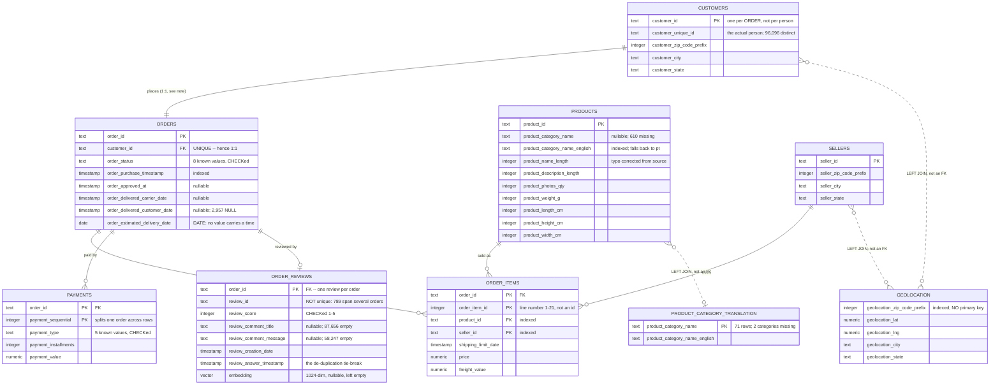

# Entity relationship diagram — `core`

The working schema after Phase 2. Written as Mermaid so it diffs in git and
renders on GitHub without a binary image drifting out of sync with the SQL.

The authority is [`migrations/004_keys_and_indexes.sql`](../migrations/004_keys_and_indexes.sql);
this diagram is a reading of it. Row counts are the seeded values.

## How to read the lines

Solid lines are declared foreign keys. Dashed lines are joins we perform but
the database does not enforce, because the data will not support a constraint.

| Relationship | Cardinality | Why |
| --- | --- | --- |
| `customers → orders` | **1:1** | `orders.customer_id` is `UNIQUE` |
| `orders → order_items` | 1:0..N | 775 orders have no items |
| `orders → payments` | 1:0..N | 1 order has no payment; split payments give several rows |
| `orders → order_reviews` | 1:0..1 | 768 orders have no review; duplicates removed in cleaning |
| `products → order_items` | 1:0..N | every product happens to be ordered at least once |
| `sellers → order_items` | 1:0..N | |

## The three relationships that are not foreign keys

| Join | Orphans | Why it cannot be enforced |
| --- | ---: | --- |
| `products.product_category_name → translation` | 13 products | 2 categories missing from the 71-row file |
| `customers.customer_zip_code_prefix → geolocation` | 157 zips | geolocation does not cover every zip in use |
| `sellers.seller_zip_code_prefix → geolocation` | 7 zips | same |

Declaring any of these would force us either to delete real rows or to invent
source data. They are `LEFT JOIN` lookups instead.

## The 1:1 that surprises people

`customers` is not a table of people. Olist issues a **fresh `customer_id` for
every order**, so the table is really an order-address snapshot: 99,440 rows,
one per order. The person is `customer_unique_id` — 96,096 distinct, averaging
1.035 orders each, with one person placing 17.

Two consequences for Phase 3:

- `count(DISTINCT customer_id)` counts **orders**, not people. Use
  `count(DISTINCT customer_unique_id)` for people.
- The address belongs to the order, not the person: 250 people used more than
  one zip code across their orders, 122 more than one city, and 39 more than
  one state. Collapsing `customers` down to one row per person would silently
  discard those addresses, which is why the table keeps its per-order shape.

## What has no primary key, and why

`geolocation` has none. No column or combination is unique even after
whole-row de-duplication (1,000,163 → 738,332), and nothing references an
individual row. It is a coordinate lookup, not an entity. A surrogate identity
column would invent a key nothing would ever use.
